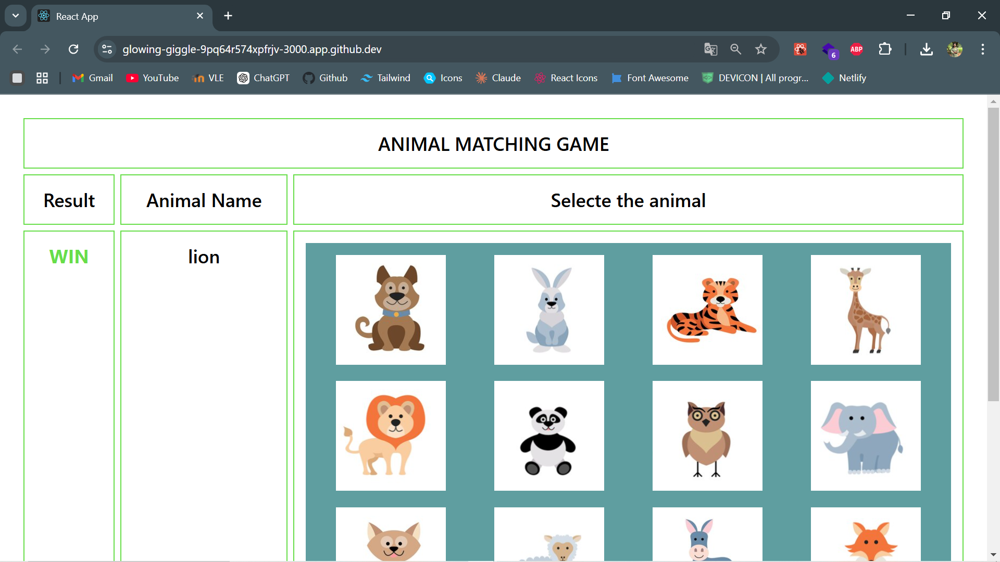

# IT3133-P-Assignment042020ICT35

# Animal Matching Game 🎮

A fun and educational React-based game for kids! 

**🚀 Features:**

* **Random Animal Challenge:** A new animal name is displayed randomly each round.
* **Dynamic Image Grid:** A grid of 16 animal images is generated dynamically.
* **Win/Lose Tracking:** The game keeps track of correct and incorrect choices.
* **User-Friendly Interface:** A simple and intuitive design for easy play.

**🛠️ Technologies Used:**

* **React:** For building the user interface.
* **JavaScript:** For game logic and interactions.
* **CSS:** For styling the game.

**How to Play:**

1. **Clone the Repository:**
   ```bash
   git clone https://github.com/UOV-Assignments/IT3133-P-Assignment042020ICT35.git

2. **Install Dependencies:**
```bash
cd assignment04
npm install
```


3. **Start the Development Server:**
```bash
npm start
```

4. **Play the Game:**
 Open your web browser and navigate to http://localhost:3000.


**Methods for Playing**


At the top of the screen, a random animal name appears.
From the 4x4 grid of animal photos, pick the matching picture.
 Feedback: 

* 🚀"WIN" appears if it is accurate.
* 🚀"LOSE" is shown if it's wrong.

Once the feedback has been displayed, the game immediately resets for the following round.


**How it looks:**

**1.**


**2.**
